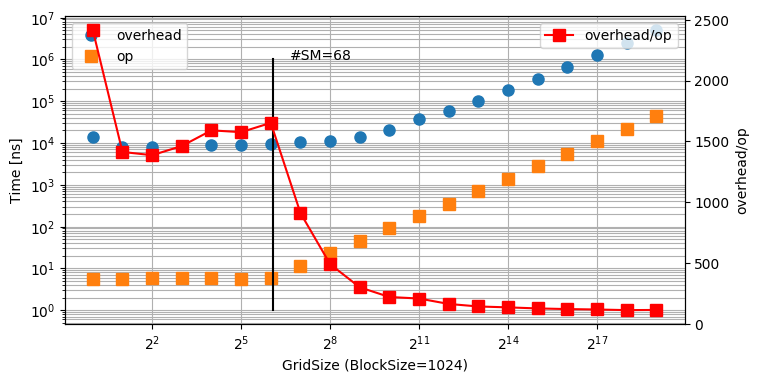

# CUDA kernel function launch overhead

## Build
```bash
git clone https://github.com/enp1s0/cuda-launch-overhead
cd cuda-launch-overhead
make
```

## Result


```
[GridSize =        1, BlockSize = 1024] elapsed time A :          200661 [ns], elapsed time B :         6181063 [ns], time/op : 5.703356e+00 [ns], launch overhead :   13774 [ns]
[GridSize =        2, BlockSize = 1024] elapsed time A :          195098 [ns], elapsed time B :         6180184 [ns], time/op : 5.707823e+00 [ns], launch overhead :    8065 [ns]
[GridSize =        4, BlockSize = 1024] elapsed time A :          194970 [ns], elapsed time B :         6180778 [ns], time/op : 5.708511e+00 [ns], launch overhead :    7914 [ns]
[GridSize =        8, BlockSize = 1024] elapsed time A :          195657 [ns], elapsed time B :         6189285 [ns], time/op : 5.715969e+00 [ns], launch overhead :    8357 [ns]
[GridSize =       16, BlockSize = 1024] elapsed time A :          196238 [ns], elapsed time B :         6185150 [ns], time/op : 5.711472e+00 [ns], launch overhead :    9085 [ns]
[GridSize =       32, BlockSize = 1024] elapsed time A :          196042 [ns], elapsed time B :         6181559 [ns], time/op : 5.708234e+00 [ns], launch overhead :    8995 [ns]
[GridSize =       64, BlockSize = 1024] elapsed time A :          196492 [ns], elapsed time B :         6182438 [ns], time/op : 5.708643e+00 [ns], launch overhead :    9432 [ns]
[GridSize =      128, BlockSize = 1024] elapsed time A :          384410 [ns], elapsed time B :        12353173 [ns], time/op : 1.141430e+01 [ns], launch overhead :   10387 [ns]
[GridSize =      256, BlockSize = 1024] elapsed time A :          759167 [ns], elapsed time B :        24694637 [ns], time/op : 2.282664e+01 [ns], launch overhead :   11184 [ns]
[GridSize =      512, BlockSize = 1024] elapsed time A :         1509585 [ns], elapsed time B :        49379229 [ns], time/op : 4.565205e+01 [ns], launch overhead :   13659 [ns]
[GridSize =     1024, BlockSize = 1024] elapsed time A :         3011799 [ns], elapsed time B :        98746611 [ns], time/op : 9.129983e+01 [ns], launch overhead :   20087 [ns]
[GridSize =     2048, BlockSize = 1024] elapsed time A :         5832887 [ns], elapsed time B :       191311775 [ns], time/op : 1.768865e+02 [ns], launch overhead :   36672 [ns]
[GridSize =     4096, BlockSize = 1024] elapsed time A :        11462073 [ns], elapsed time B :       376435911 [ns], time/op : 3.480662e+02 [ns], launch overhead :   56641 [ns]
[GridSize =     8192, BlockSize = 1024] elapsed time A :        22722002 [ns], elapsed time B :       746687092 [ns], time/op : 6.904269e+02 [ns], launch overhead :   98093 [ns]
[GridSize =    16384, BlockSize = 1024] elapsed time A :        45246249 [ns], elapsed time B :      1487198773 [ns], time/op : 1.375153e+03 [ns], launch overhead :  185233 [ns]
[GridSize =    32768, BlockSize = 1024] elapsed time A :        90466719 [ns], elapsed time B :      2974318325 [ns], time/op : 2.750255e+03 [ns], launch overhead :  346357 [ns]
[GridSize =    65536, BlockSize = 1024] elapsed time A :       180901385 [ns], elapsed time B :      5948503935 [ns], time/op : 5.500414e+03 [ns], launch overhead :  663806 [ns]
[GridSize =   131072, BlockSize = 1024] elapsed time A :       361761827 [ns], elapsed time B :     11896881687 [ns], time/op : 1.100075e+04 [ns], launch overhead : 1289332 [ns]
[GridSize =   262144, BlockSize = 1024] elapsed time A :       723408320 [ns], elapsed time B :     23793569391 [ns], time/op : 2.200142e+04 [ns], launch overhead : 2465787 [ns]
[GridSize =   524288, BlockSize = 1024] elapsed time A :      1446690212 [ns], elapsed time B :     47580931010 [ns], time/op : 4.399704e+04 [ns], launch overhead : 4995188 [ns]
```

- Intel Xeon E-2136
- NVIDIA GeForce RTX 3080 (68 SMs)

## License
MIT
